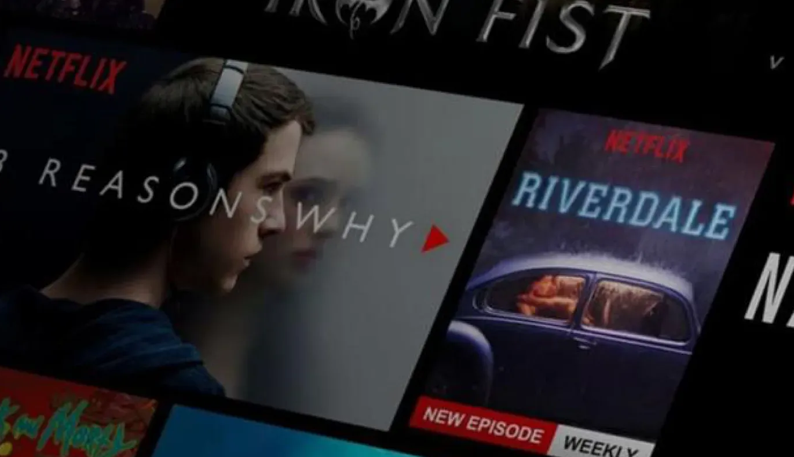

# 🎬 MovieMosaic - AI-Powered Movie Recommendation System

## 📌 About

MovieMosaic is an advanced movie recommendation system designed to enhance user experience through content-based, collaborative, and hybrid filtering techniques. Built using Streamlit, this system employs Natural Language Processing (NLP), Matrix Factorization, and Deep Neural Networks to generate highly personalized recommendations.

## 🚀 Features

- Content-Based Filtering: Uses NLP (Word2Vec) for semantic movie similarity.
- Collaborative Filtering: User-based, item-based, and matrix factorization techniques (SVD).
- Deep Learning Model: Softmax Deep Neural Network for enhanced recommendation accuracy.
- Hybrid Model: Combines collaborative and content-based approaches for better results.
- Performance Evaluation: RMSE scores highlight model efficiency (Deep Learning RMSE = 0.6959, Matrix Factorization RMSE = 0.8280).

## 📊 Dataset

This project uses the MovieLens 25M dataset from GroupLens:
🔗 Download [MovieLens Dataset](https://grouplens.org/datasets/movielens/25m/)

Dataset files:

- ratings.csv → User ratings
- movies.csv → Movie metadata
- tags.csv → Movie tags (for NLP-based recommendations)

## 📈 Key Findings

- Matrix Factorization & Deep Learning models outperform traditional methods.
- System intelligently recommends movies based on genre & user preferences.
- Future Improvements: Incorporate reinforcement learning, optimize for scalability, and enhance temporal factor modeling.

## 🎭 Live Demo

🔗 Try the application: [Movie Recommendation System](https://movie-recommendation-system-cse482.streamlit.app/)
